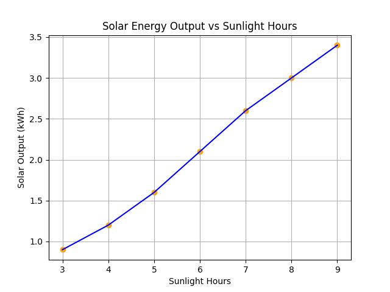
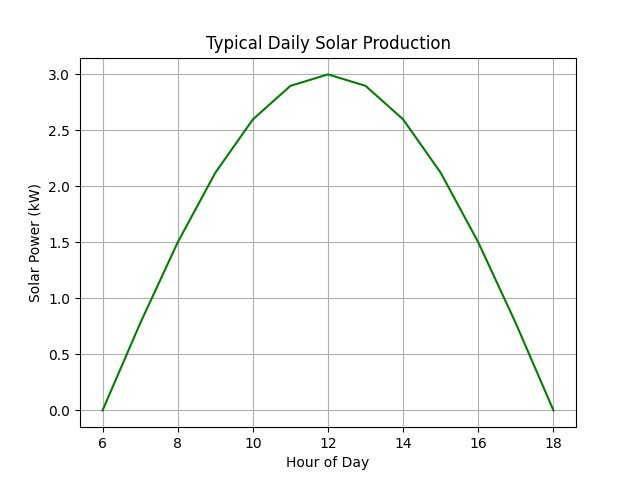
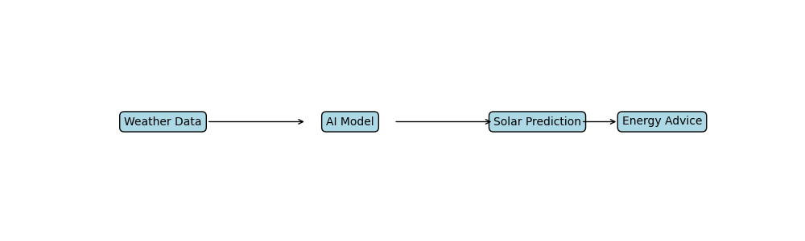

# solar-sensor-ai

Building AI Course Project

## Summary
SolarSense AI predicts daily solar energy production using weather data and recommends the best times to use electricity-heavy appliances. This helps households with solar systems manage energy more efficiently and reduce dependence on unreliable grid power.

## Background
Many households in countries like Nigeria experience frequent power outages and increasingly rely on solar panels and battery storage.

However, solar energy production changes depending on weather conditions, sunlight intensity, and time of day. Many users cannot easily predict how much energy their solar systems will generate.

### This project aims to solve the following problems:

1. People cannot easily estimate daily solar power generation
2. Poor energy planning leads to battery drain
3. Many households still depend on fuel generators
4. Solar energy may be underutilized due to lack of forecasting

My personal motivation comes from the unreliable electricity supply in my region. Many homes invest in solar systems but still struggle to manage their energy usage efficiently. This project explores how AI can help households make smarter energy decisions.

## How is it used?
SolarSense AI would work as a small application or dashboard.

### Example workflow

1. The system collects weather forecast data (sunlight, cloud cover, temperature)
2. The AI model predicts the expected solar energy production for the day
3. The solar output is being forecast
4. The system recommends the best times to run appliances.

`Weather Data → AI Prediction Model → Solar Output Forecast → Energy Usage Recommendation`

### Example recommendations:

1. Run washing machine at 1PM – (highest solar output)
2. Charge devices between 12PM – 3PM
3. Avoid heavy usage after 6PM

### Users

1. Homeowners with solar systems
2. Small businesses using solar power
3. Off-grid communities
4. Energy planners
   
## Example Visualization

### Solar Output vs Sunlight Hours



### Daily Solar Production Curve



### AI Workflow



## Data sources and AI methods

### Data Sources

* NASA POWER Solar Data  
https://power.larc.nasa.gov

* OpenWeather API  
https://openweathermap.org/api

### AI Methods

The project uses simple machine learning models such as:

* Linear Regression
* Decision Trees
* Time Series Forecasting

### Python libraries used:

* scikit-learn
* pandas
* numpy
* matplotlib

### Example simple prototype code:
```
from sklearn.linear_model import LinearRegression
import pandas as pd

# Example dataset
data = pd.DataFrame({
    "sunlight_hours":[4,5,6,7,8],
    "solar_output":[1.2,1.5,2.0,2.5,3.0]
})

X = data[["sunlight_hours"]]
y = data["solar_output"]

model = LinearRegression()
model.fit(X,y)

prediction = model.predict([[7]])

print("Predicted solar output:", prediction)
```
This simple model predicts solar energy output based on sunlight hours.

## Challenges

### This project has a few constraints:

1. Solar output varies depending on panel quality
2. Data availability may vary by region
3. Battery storage capacity is not considered
4. Weather forecast can sometimes be inaccurate.

AI predictions should be used as estimates, not guarantees.

## What next?

SolarSense AI could grow into a larger system such as:

* A mobile app for solar households
* Integration with smart home devices
* Real-time solar monitoring using IoT sensors
* Battery storage optimization

### Future improvements could include:

* Deep learning models for more accurate forecasting
* Community solar forecasting for neighborhoods

To expand the project further, collaboration with energy engineers and access to real solar panel datasets would be beneficial.
## Acknowledgments

* NASA POWER Solar Dataset  
https://power.larc.nasa.gov

* OpenWeather API  
https://openweathermap.org/api

* Elements of AI – Building AI Course

## Project Owner
### **Ndudi-Okehi Ndudi**
ndudiokehi@gmail.com

